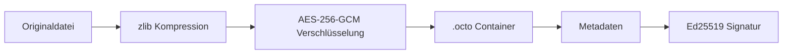

<div align="center">


# 🐙 OctoCrypt


<br>


</div>

---

## `> init project`

**OctoCrypt** ist ein modernes Sicherheitswerkzeug zur **Verschlüsselung sensibler Dateien** mit einem Fokus auf:

- **starke authentifizierte Verschlüsselung**
- **digitale Signaturen**
- **Integritätsschutz**
- **sichere Passwortverarbeitung**
- **kompakte Speicherung durch Kompression**

Das Ziel: ein Tool, das sich **wie ein professionelles Security-Projekt** anfühlt und gleichzeitig **klar, praktisch und robust** bleibt.

---

## `> core features`

```txt
[✓] AES-256-GCM Datei-Verschlüsselung
[✓] Sichere Passwortvalidierung
[✓] Ed25519 digitale Signaturen
[✓] zlib-Kompression
[✓] CLI für schnelle Workflows
[✓] GUI für komfortable Nutzung
[✓] Integritäts- und Manipulationsschutz
[✓] Eigenes .octo Containerformat
````

---

## `> security architecture`

<div align="center">



</div>

---

## `> tech stack`

<div align="center">


</div>

```txt
Cryptography: AES-256-GCM
Signing:      Ed25519
Compression:  zlib
GUI:          Tkinter
Runtime:      Python 3.10+
```

---

## `> installation`

```bash
git clone https://github.com/hypernwsn233/octocrypt.git
cd octocrypt
pip install -r requirements.txt
```

---

## `> usage`

### Datei verschlüsseln

```bash
python octocrypt.py encrypt secret.txt

password: ********
confirm password: ********

file encrypted -> secret.octo
```

### Datei entschlüsseln

```bash
python octocrypt.py decrypt secret.octo

password: ********

file decrypted -> secret.txt
```

### Signaturschlüssel generieren

```bash
python octocrypt.py keygen
```

### GUI starten

```bash
python octocrypt.py gui
```

---

## `> real cli style`

```bash
octocrypt encrypt secret.txt
password: ********
file encrypted -> secret.octo
```

Für Windows kann `octocrypt.bat` verwendet werden, um denselben Workflow bereitzustellen.

---

## `> project structure`

```bash
octocrypt/
│
├── octocrypt.py
├── requirements.txt
├── octocrypt.bat
├── README.md

```

---

## `> .octo file format`

Das `.octo`-Format wurde so entworfen, dass es **strukturiert, prüfbar und erweiterbar** bleibt.

```txt
+--------------------------------------------------+
| HEADER                                           |
| Version / Magic Bytes                            |
+--------------------------------------------------+
| METADATA                                         |
| Algorithmus, Salt, Nonce, Hash, Signatur         |
+--------------------------------------------------+
| CIPHERTEXT                                       |
| AES-256-GCM verschlüsselte Nutzdaten             |
+--------------------------------------------------+
```

---

## `> why aes-256-gcm`

**AES-256-GCM** bietet:

* starke symmetrische Verschlüsselung
* Authentifizierung der Daten
* Erkennung von Manipulation
* hohe Praxistauglichkeit
* moderne Standard-Sicherheit

---

## `> why ed25519`

**Ed25519** wird verwendet für:

* schnelle digitale Signaturen
* starke Integritätsprüfung
* moderne Sicherheitsstandards
* klare Trennung zwischen Verschlüsselung und Signatur

---

## `> security notes`

```txt
[!] Niemals Passwörter über --password oder Klartext-Parameter übergeben
[!] Private Schlüssel nur auf vertrauenswürdigen Systemen speichern
[!] Schlüssel regelmäßig sichern
[!] Signaturprüfung beim Decrypt aktiviert lassen
[!] Produktionsdaten nur mit sicheren Backup-Strategien verschlüsseln
```

Standardpfad für den privaten Schlüssel:

```bash
~/.octocrypt/ed25519_private.pem
```

---

## `> design philosophy`

> **"Encryption should be strong, clean and practical."**

> **"Security is not a feature. It is the foundation."**

> **"If data matters, protection must be deliberate."**

---

## `> possible future upgrades`

```txt
[ ] Drag & Drop GUI
[ ] Multi-file encryption
[ ] Directory packaging
[ ] Hardware-key support
[ ] Secure key vault integration
[ ] Argon2-based KDF
[ ] Dark terminal-themed GUI
[ ] Signed release builds
```

---

## `> status`

<div align="center">


</div>

---

## `> terminal preview`

```bash
┌──(octocrypt㉿secure-node)-[~/projects/octocrypt]
└─$ python octocrypt.py encrypt classified.pdf

[INFO] Loading file...
[INFO] Applying compression...
[INFO] Generating salt and nonce...
[INFO] Encrypting with AES-256-GCM...
[INFO] Signing metadata with Ed25519...
[SUCCESS] Output written to classified.octo
```

---

## `> author`

<div align="center">

# Oktopus-Motor

**Cybersecurity • Secure Software • Full-Stack Engineering**


</div>

---

<div align="center">

## Zugriff erkannt. README erfolgreich geladen.


</div>
```

Se você quiser, eu posso fazer agora uma **versão 2 ainda mais brutal**, com tema **black + neon green + red alert**, parecendo interface de invasão real.
